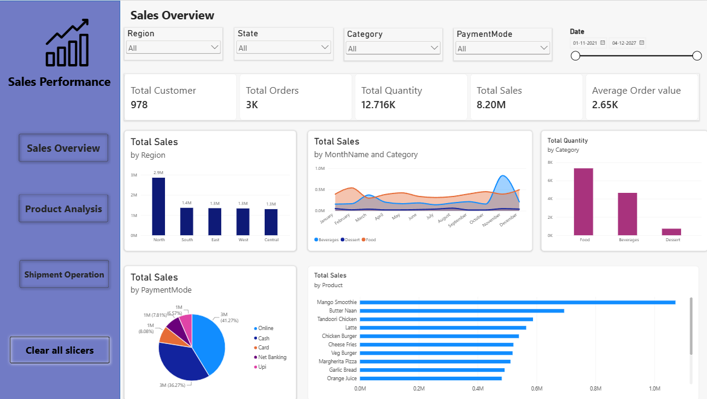

# Sales Analytics Dashboard | Power BI

## Project Overview

Interactive Sales Analytics Dashboard built using Microsoft Power BI to analyze sales performance, revenue, products, regions, cities, and payment methods.

## Objectives

- Analyze sales performance
- Track key business KPIs
- Identify top-performing products
- Compare regional and city-wise sales
- Analyze payment methods
- Identify sales trends

## Tools & Technologies

- Microsoft Power BI
- Power Query
- DAX
- Microsoft Excel
- Data Visualization

## Data Cleaning

- Removed duplicates
- Handled missing values
- Corrected data types
- Cleaned and standardized data
- Transformed data using Power Query

## Key KPIs

- Total Sales
- Total Orders
- Total Quantity
- Average Order Value
- Total Shipments

## Dashboard Analysis

- Sales Overview
- Product Analysis
- Regional Analysis
- Category Analysis
- Payment Method Analysis
- Sales Trends

## Dashboard Features

- Interactive KPI Cards
- Slicers
- Charts and Graphs
- Tables and Matrices
- Interactive Filters

## Project Structure

```text
Sales-Analytics-Dashboard/
│
├── 01_Raw_Data/
│   └── sales_dataset.csv
│
├── 02_Report/
│   └── Sales_Analytics_Dashboard.pbix
│
├── Assets/
│   └── dashboard.png
│
└── README.md
```

## Dashboard Preview



## Skills Demonstrated

- Data Cleaning
- Data Transformation
- Power Query
- DAX
- Data Visualization
- Exploratory Data Analysis
- Dashboard Development
- Business Intelligence

## Conclusion

This project demonstrates the use of Power BI to transform sales data into an interactive dashboard and generate meaningful business insights.

## Author

**Mahima Kamatwar**

Aspiring Data Analyst

- GitHub: https://github.com/Mahima-Kamatwar
- LinkedIn: https://linkedin.com/in/mahima-kamatwar-908875287